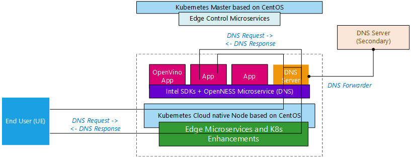
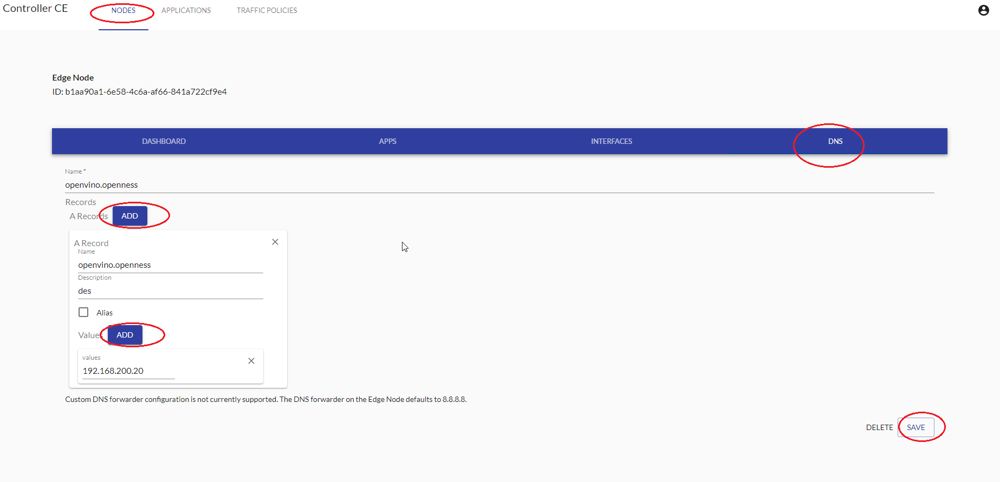

```text
SPDX-License-Identifier: Apache-2.0
Copyright (c) 2019 Intel Corporation
```
<!-- omit in toc -->
# Edge DNS
- [Overview](#overview)
  - [OnPrem usage](#onprem-usage)

## Overview 
The edge platform is required to provides access to DNS. The edge platform receives the application DNS rules from the controller. This is specified in ETSI MEC. From 5G edge deployment perspective Primary DNS (priDns) and Secondary DNS (secDns) needs to be configured which is going to be consumed by the SMF. 

To address all this DNS requirement and also for DNS service for edge applications and network functions OpenNESS supports DNS microservice. 



_Figure - DNS support on OpenNESS overview_

> Note: Secondary DNS service is out of the scope of OpenNESS and is only used for DNS forwarding.

EdgeDNS is a functionality to provide Domain Name System (DNS) Server with a possibility to be controlled by its CLI. EdgeDNS Server listens for requests from client's CLI. After receiving CLI request function handling the request adds or removes the RULE inside of EdgeDNS's database. EdgeDNS supports only type A records for Set/Delete Fully Qualified Domain Names (FQDN) and current forwarder is set to 8.8.8.8 (set in docker-compose.yml). In OnPremises mode for controlling API EdgeDNS server uses unix socket file and requires its CLI to be placed in the same host called EdgeNode. 

### OnPrem usage

All applications(VMs and containers) deployed in On-Premise mode can leverage DNS resolution of EdgeDNS service configured through the Controller.
Only entries that match the `local.mec` domain(e.g `service.local.mec`) can be resolved by deployed applications.
All entries that are provided to EdgeDNS service can be resolved by data plane clients.

To be able to control EdgeDNS prerequisite need to be satisfied:
Prerequisite:
- Enrollment phase completed successfully.
- User is logged in to UI.
- NTS must be started\configured.

At this point a user can manage DNS entries by following steps:
- From UI navigate to "NODES" tab click "EDIT" on the edge node, then navigate to "DNS" tab.
- Add a Name for your DNS rule. In the example provided this is openvino.openness.
- Click "ADD" beside rerecords field, sub-window titled 'A Record' will pop-up.
- Add a Name to "A Record" field and provide description.
- Click on "ADD" near the values field. A field 'values' will pop-up.
- Provide IP address for DNS entry in the "values" field. For this example this is 192.168.200.20 (It is important to remember this network as later steps on configuring will use interface on same subnet)
- Click "SAVE" in the bottom right corner.



Additionally manual configuration needs to be run from a terminal on the EdgeNode.

Configure DNS container's KNI interface:

```
docker exec -it <Container_ID_of_mec-app-edgednssvr> sudo ip link set dev vEth0 arp off
docker exec -it <Container_ID_of_mec-app-edgednssvr> sudo ip a a 53.53.53.53/24 dev vEth0
docker exec -it <Container_ID_of_mec-app-edgednssvr> sudo ip link set dev vEth0 up
docker exec -it <Container_ID_of_mec-app-edgednssvr> sudo ip route add 192.168.200.0/24 dev vEth0
```

Make a request on the DNS interface subnet to register the KNI interface with NTS client (press CTRL + C buttons as soon as a request is made (no expectation for hostname to resolve)):

```
docker exec -it <Container_ID_of_mec-app-edgednssvr> wget 192.168.200.123 -Y off
```
