```text
SPDX-License-Identifier: Apache-2.0
Copyright (c) 2019-2020 Intel Corporation
```
<!-- omit in toc -->
# Core Network Configuration Agent (CNCA)
- [4G/LTE Core Configuration using CNCA](#4glte-core-configuration-using-cnca)
  - [Configuring in On-Premises mode](#configuring-in-on-premises-mode)
    - [CUPS UI Prerequisites](#cups-ui-prerequisites)
    - [First time access to CUPS UI](#first-time-access-to-cups-ui)
      - [Prerequisites](#prerequisites)
      - [Steps to access UI](#steps-to-access-ui)
    - [Get User Plane specific information and Update](#get-user-plane-specific-information-and-update)
    - [Add a new user plane information to Core](#add-a-new-user-plane-information-to-core)
    - [Delete a user plane information from Core](#delete-a-user-plane-information-from-core)
- [5G NGC components bringup and Configuration using CNCA](#5g-ngc-components-bringup-and-configuration-using-cnca)
  - [On-Premises mode](#on-premises-mode)
    - [Bringing up NGC components in On-Premises mode](#bringing-up-ngc-components-in-on-premises-mode)
    - [Configuring in On-Premises mode](#configuring-in-on-premises-mode-1)
      - [Certificates Management for communicating with 5G core micro-services](#certificates-management-for-communicating-with-5g-core-micro-services)
      - [Edge Node services operations with 5G Core (through OAM interface)](#edge-node-services-operations-with-5g-core-through-oam-interface)
        - [Registration of UPF services associated with Edge-node with 5G Core](#registration-of-upf-services-associated-with-edge-node-with-5g-core)
      - [Traffic influence operations with 5G Core (through AF interface)](#traffic-influence-operations-with-5g-core-through-af-interface)
      - [Packet Flow Description operation with 5G Core (through AF interface)](#packet-flow-description-operation-with-5g-core-through-af-interface)
  - [Traffic Influence Subscription description](#traffic-influence-subscription-description)
    - [Identification (Mandatory)](#identification-mandatory)
    - [Traffic Description Group (Mandatory)](#traffic-description-group-mandatory)
    - [Target UE Identifier (Mandatory)](#target-ue-identifier-mandatory)
    - [Application Relocation (Optional)](#application-relocation-optional)
    - [Traffic Routing (Optional)](#traffic-routing-optional)
    - [Spatial Validity (Optional)](#spatial-validity-optional)
    - [Temporal Validity (Optional)](#temporal-validity-optional)
    - [UPF Event Notifications (Optional)](#upf-event-notifications-optional)
    - [AF to NEF specific (Optional)](#af-to-nef-specific-optional)
  - [Packet Flow Description transaction description](#packet-flow-description-transaction-description)

# 4G/LTE Core Configuration using CNCA

## Configuring in On-Premises mode

In case of On-Premises deployment mode, Core network can be configured through the CNCA CUPS UI interface.

### CUPS UI Prerequisites

- Controller installation, configuration and run as root. Before building, setup the controller env file for CUPS as below:

```
  REACT_APP_CONTROLLER_API=http://<controller_ip_address>>:8080
  REACT_APP_CUPS_API=http://<<oamagent_ip_address>>:8080
```

- Build the full controller stack including CUPS:

    `make build`

  - Start the full controller stack and CUPS UI:

    `make all-up`

    > NOTE: To bring up just the CUPS UI run `make cups-ui-up`
  - Check whether controller CUPS UI already bring up by:

```
    Docker ps
    CONTAINER ID   IMAGE        COMMAND                  CREATED     STATUS      PORTS
    0eaaafc01013   cups:latest  "docker-entrypoint.s…"   8 days ago  Up 8 days   0.0.0.0:3010->80/tcp
    d732e5b93326   ui:latest    "docker-entrypoint.s…"   9 days ago  Up 9 days   0.0.0.0:3000->80/tcp
    8f055896c767   cce:latest   "/cce -adminPass cha…"   9 days ago  Up 9 days   0.0.0.0:6514->6514/tcp, 0.0.0.0:8080-8081->8080-8081/tcp, 0.0.0.0:8125->8125/tcp
    d02b5179990c   mysql:8.0    "docker-entrypoint.s…"   13 days ago Up 9 days   33060/tcp, 0.0.0.0:8083->3306/tcp
```

- OAMAgent(called EPC-OAM) and EPC Control plane installation, configuration and run as `root`.
  - OAMAgent acts as epc agent between the OpenNESS controller and EPC. It will process CUPS API messages (HTTP based) from the controller, parse JSON payload in the HTTP request, and then convert it to message format that can be used by EPC. And the same in reverse. Refer to the architecture specification and to README in epc-oam repo for further details.
  - For OAMAgent Installation and configuration details, refer to README in epc-oam repo.
  - EPC installation and configuration.

### First time access to CUPS UI

#### Prerequisites

- REACT_APP_CUPS_API=http://<<oamagent_ip_address>>:8080 added to Controller's `edgecontroller/.env` file.
- Controller full stack including CUPS UI are running.
- Oamagent and EPC are running.
- Confirm connection between controller and oamagent (EPC).

#### Steps to access UI

- Open any internet browser
- Type in "http://<Controller_ip_address>:3010/userplanes" in address bar.
- This will display all the existing EPC user planes list as shown below:
  &nbsp;
  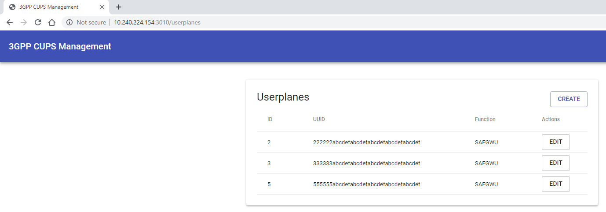

### Get User Plane specific information and Update

- Identify the specific userplane using the UUID to get additional information
- Click on **EDIT** as shown below
  &nbsp;
  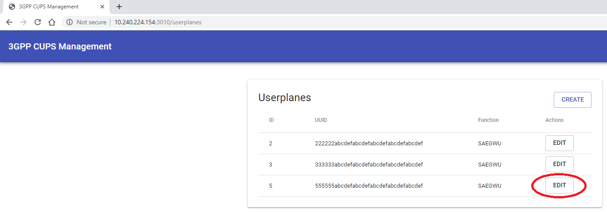
  &nbsp;

- User plane information is displayed as shown below
  &nbsp;
  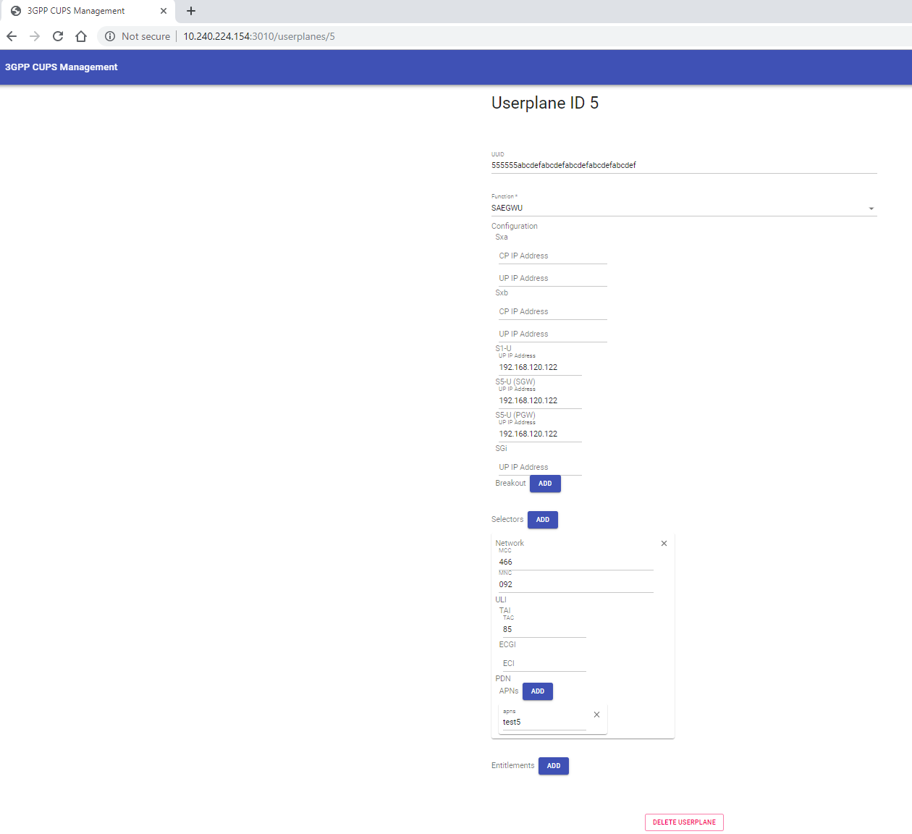
  &nbsp;

- Update parameters: any of the parameters _{S1-U , S5-U(SGW), S5-U(PGW), MNC,MCC, TAC, APN}_ as needed and then click on **Save**.
  **NOTE** A pop up window will appear with “successfully updated userplane”
  &nbsp;
  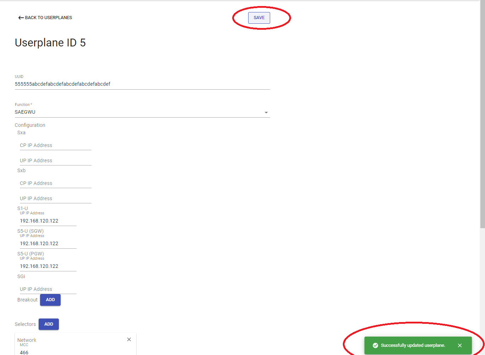
  &nbsp;

- After that, web page will automatically return back to the updated user plane list as shown below
  &nbsp;
  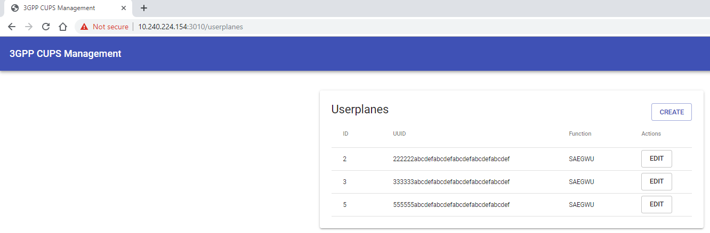
  &nbsp;

### Add a new user plane information to Core

- Click on **CREATE** button.

- Filling uuid with 36 char string, select Function as “SAEGWU” and set values for parameters: S1-U , S5-U(SGW), S5-U(PGW), MNC,MCC, TAC and APN. And click on “Save” and pop up with “successfully created userplane” as below:
  &nbsp;
  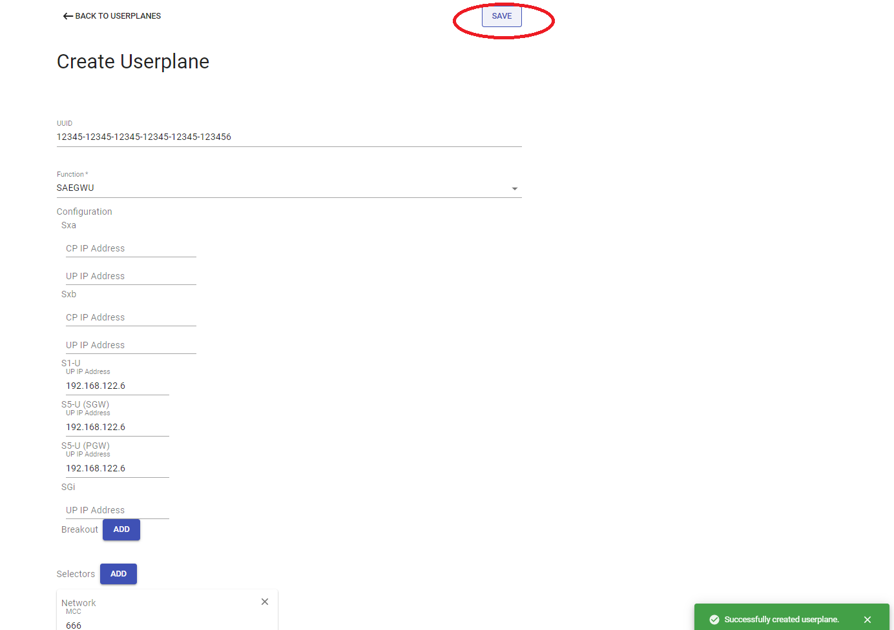
  &nbsp;

- After that, web page will automatically return back to the updated user plane list as shown below
  &nbsp;
  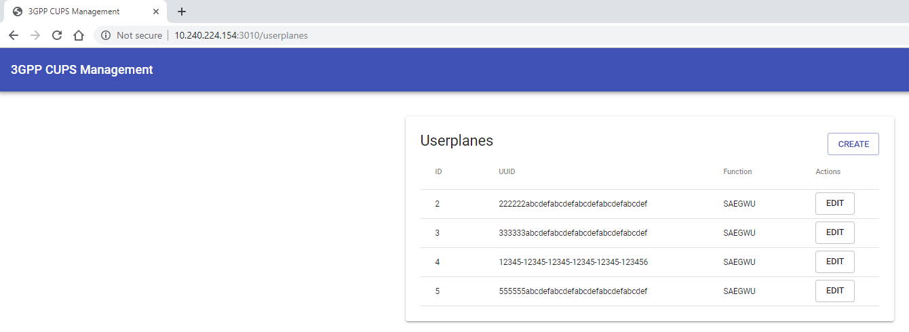
  &nbsp;

### Delete a user plane information from Core

- Find the user plane to delete using UUID and click **EDIT**

- Then web page will list the user plane information, and then click on **DELETE USERPLANE** with popup message with **successfully deleted userplane** as shown below
  &nbsp;
  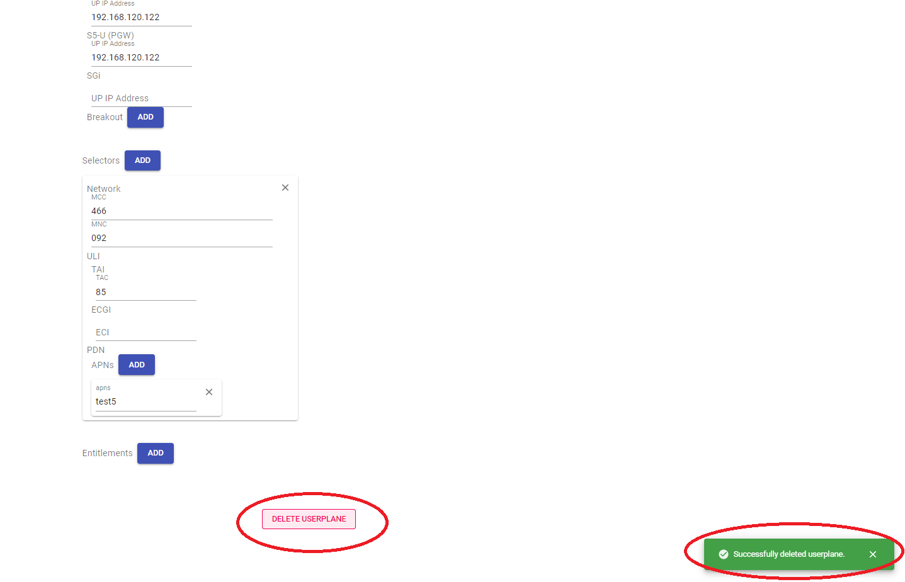
  &nbsp;

- After that, web page will automatically return back to the updated user plane list as shown below
  &nbsp;
  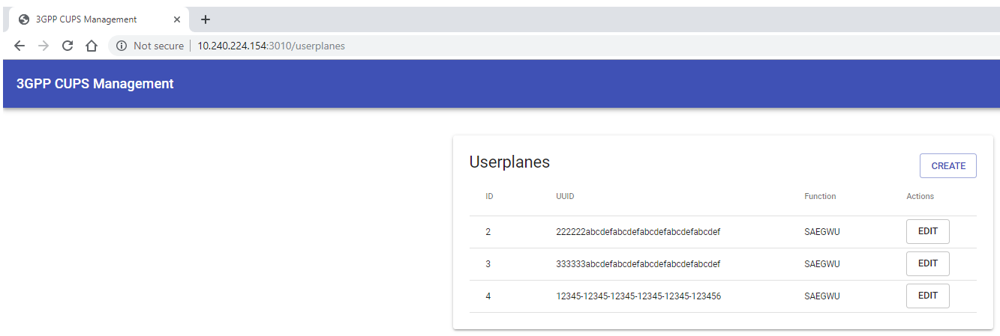
  &nbsp;

# 5G NGC components bringup and Configuration using CNCA

OpenNESS provides ansible scripts for setting up NGC components for two scenarios. Each of the scenarios is supported by a separate role in the OpenNESS Experience Kit:

1. Role "ngc_test"
  This role brings up the 5g OpenNESS setup in the loopback mode for testing and demonstrating its usability. This scenario is currently the default 5G OpenNESS scenario. The ansible scripts that are part of "ngc_test" role build, configure and start AF, NEF and OAM in the On-Premises mode. Within this role, AF, NEF and OAM are set up on the controller node.  Description of the configuration and setup of the NGC components provided in the next sections of this document refers to ngc_test role. The NGC components set up within ngc_test role can be fully integrated and tested with provided CNCA UI.

## On-Premises mode


### Bringing up NGC components in On-Premises mode

  To bring-up the NGC components in on-premises mode, enable the rule `ngc_test/onprem/master` in the file: `oek/on_premises.yml`. and then run the script `deploy_onprem.sh controller`  as described in [OpenNESS On-Premise: Controller and Edge node setup document](https://github.com/open-ness/native-on-prem/blob/master/specs/doc/getting-started/controller-edge-node-setup.md).

### Configuring in On-Premises mode

  OpenNESS On-Premises management homepage:
      sample url: http://<LANDING_UI_URL>/landing
      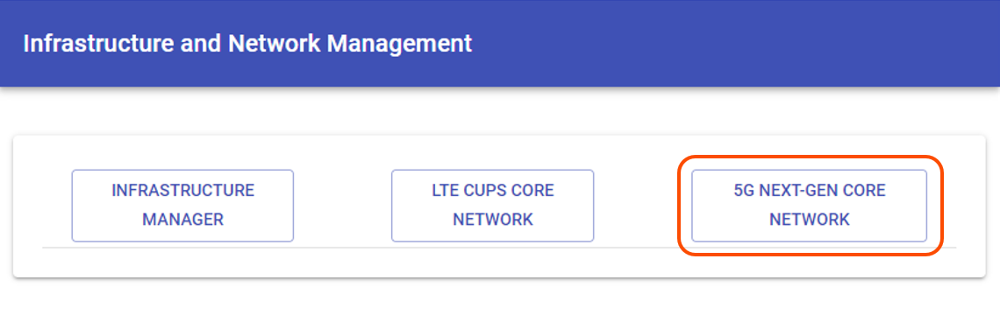
  **NOTE**: `LANDING_UI_URL` can be retrieved from `.env` file.

#### Certificates Management for communicating with 5G core micro-services
  5G Core micro-services uses HTTPS protocol over HTTP2 for communication. To communicate with 5G micro-services, the certificates used by 5G core micro-services (AF/NEF/OAM) should be imported into web browser. The root certificate `root-ca-cert.pem` which need to be imported is available at location `/etc/openness/certs/ngc/` where OpenNess Experience Kit is installed.

  **NOTE:** The certificates generated as part of OpenNess Experience Kit are self signed certificates are for testing purpose only.

  The certificate can be imported in the different browsers as:

   * Google Chrome (ver 80.0.3987): Go to settings --> Under "Privacy and security" Section Click on "More" --> Select "Manage Certificates" --> in the pop up window select "Intermediate Certification Authorities" --> Select "Import" and provide the downloaded certificate file (root-ca-cert.pem).
   * Mozilla Firefox (ver 72.0.2): Go to options --> Under "Privacy and security" Section Click on "View Certificates..." --> Under "Authorities" section click on "import" --> Provide the certificate (root-ca-cert.pem) and import it for accessing websites.

  **NOTE:** If a user don't want to import certificate in the browser or failed to import the certificates, other steps can be followed to trust the certificates:
   * User needs to access these specific 5G core components URL to trust the certificates used by the 5G core components.
   * First access the urls `https://controller_ip:8070/ngcoam/v1/af/services, https://controller_ip:8050/af/v1/pfd/transactions`.
   * On accessing these url, browser will show the warning for trusting the self-signed certificate. Proceed by trusting the certificates.

#### Edge Node services operations with 5G Core (through OAM interface)

  ***NOTE:**
  Registration of the OpenNESS Controller's AF instance with the 5G core needs to be performed manually or through any other interface exposed by the 5G Core.  OAM capabilities will be enhanced in future releases to support this. The current version of OAM supports only one instance of OpenNESS Controller to communicate.*

##### Registration of UPF services associated with Edge-node with 5G Core

   * Edge services registration home page:
      sample url: http://<cnca_ui_ip>:3020/services
      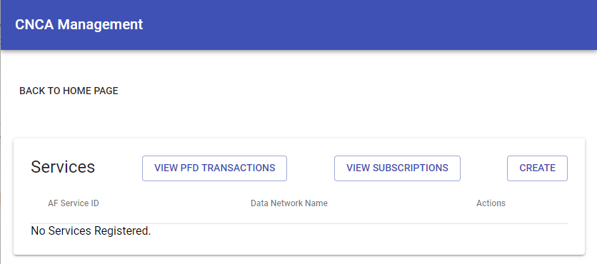

   * Registration of a new edge service offered by UPF (associated with edge-node)
      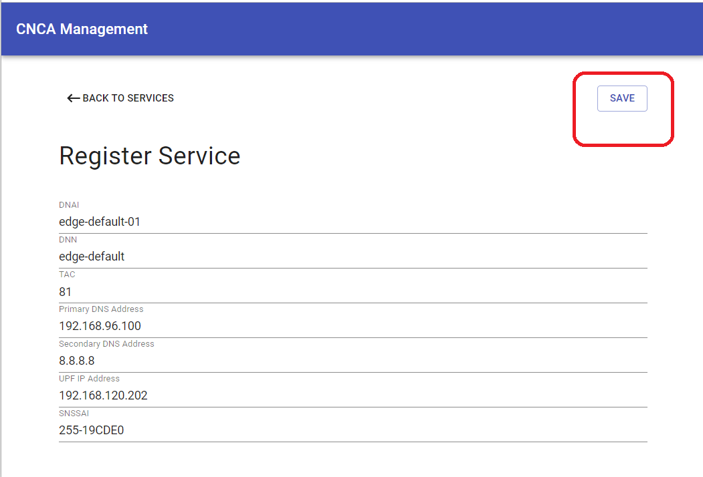

   * Display of registered edge servers with 5G Core
      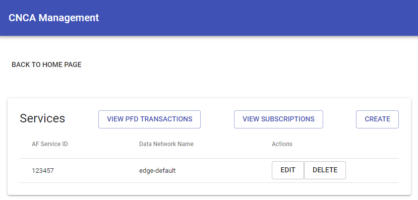

   * To edit a registered services
      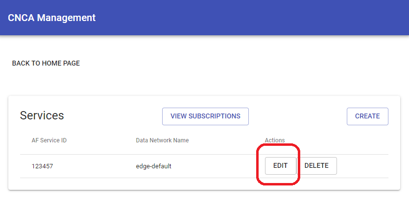

   * To delete a registered service
      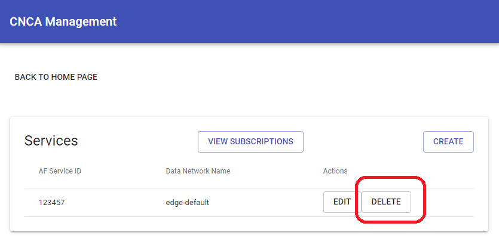

#### Traffic influence operations with 5G Core (through AF interface)

   * Edge traffic subscription submission homepage
      sample url: http://<cnca_ui_ip>:3020/subscriptions
      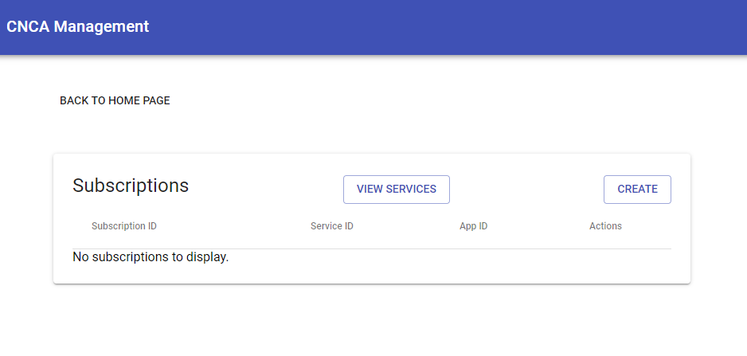

   * Edge traffic subscription submissions with 5G-Core (NEF)
      click on the "Create" button on the above homepage
      NOTE: "AF Service Id" field should be the same as the value returned through the AF services create request. In the below sample screen capture shows a different value.
      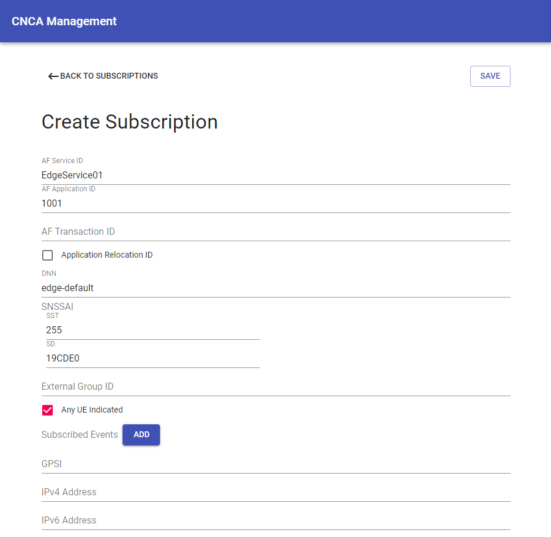
      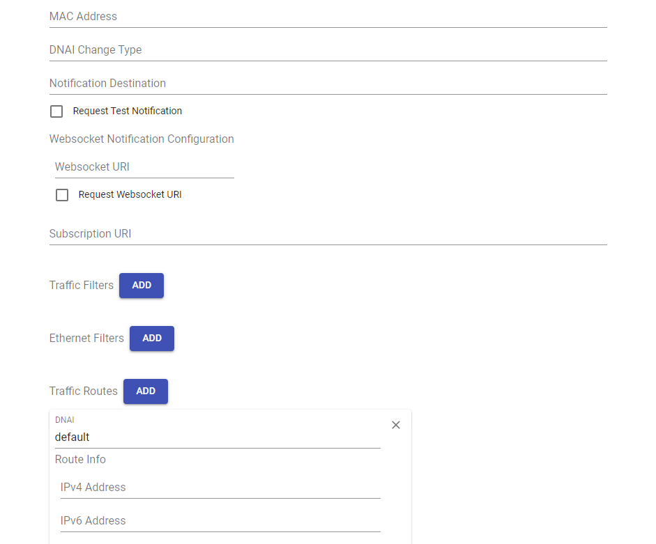
      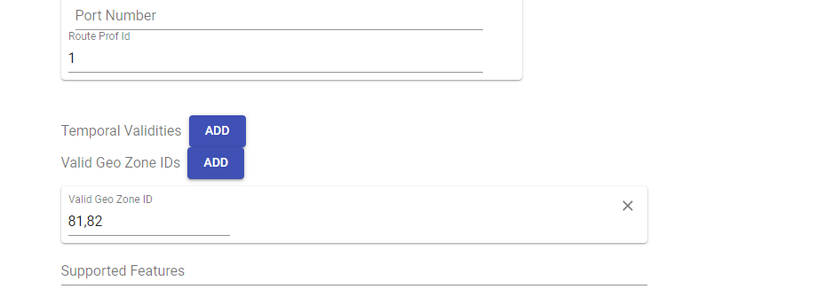

   * Display of submitted Edge traffic subscriptions
      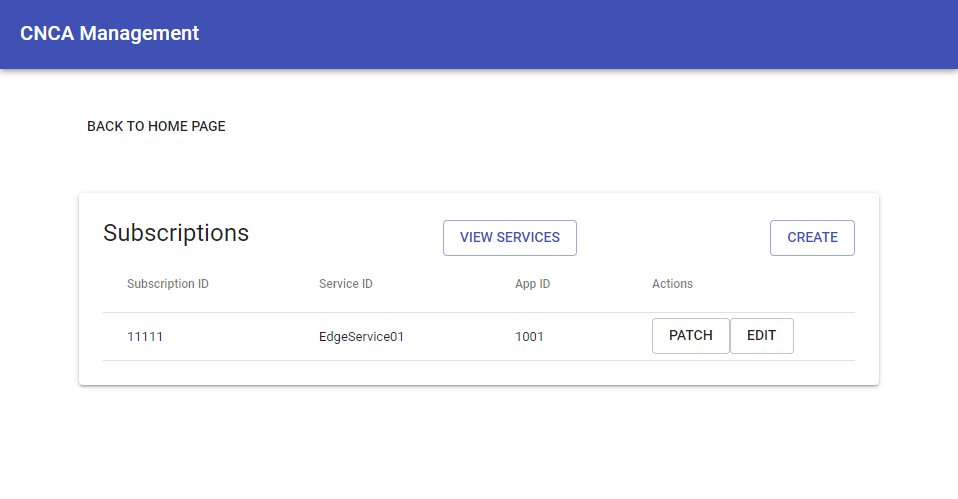

   * To edit a submitted edge traffic subscription
      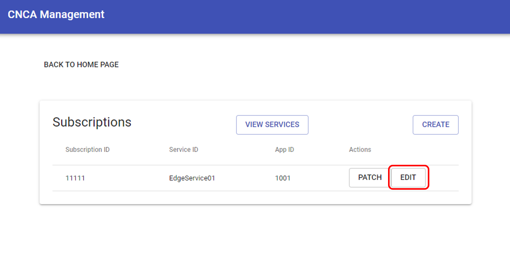

   * To patch a submitted edge traffic subscription
      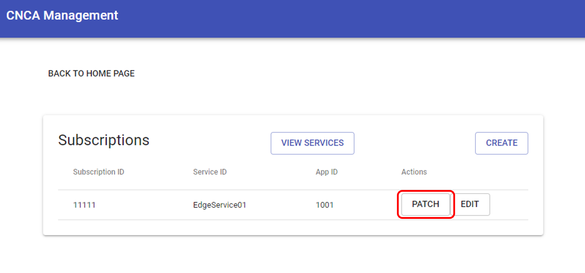

   * To delete a submitted edge traffic subscription
      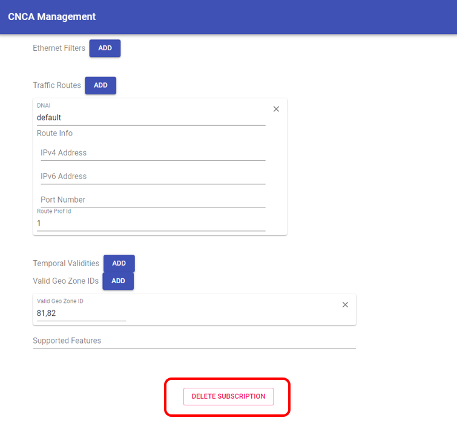

#### Packet Flow Description operation with 5G Core (through AF interface)

   * Edge traffic PFD transaction submission homepage
      sample url: http://<cnca_ui_ip>:3020/pfds
      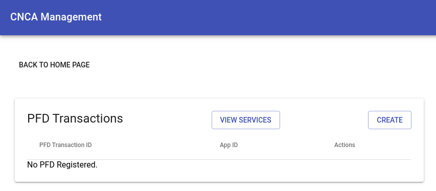

   * Edge PFD transaction submissions with 5G-Core (NEF)
      click on the "Create" button on the above homepage
      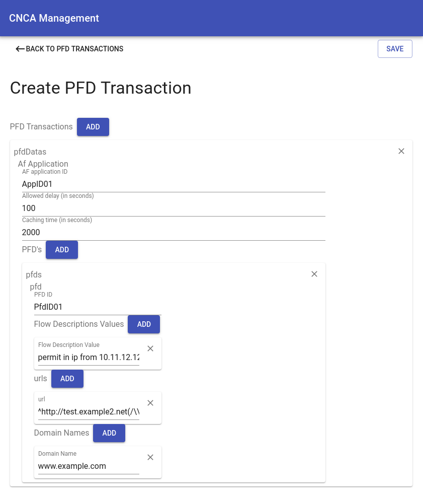

   * Display of submitted Edge PFD transaction
      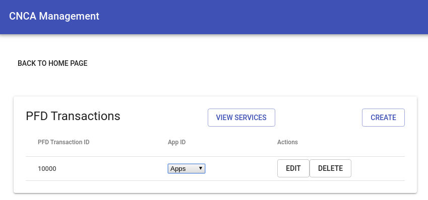

   * To edit a submitted edge PFD transaction
      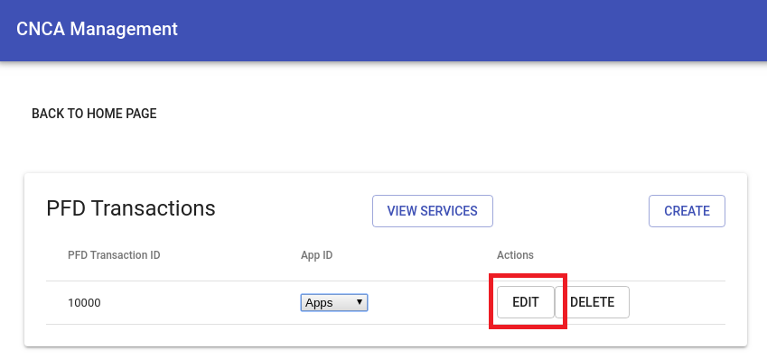

   * To edit a submitted edge PFD transaction application
      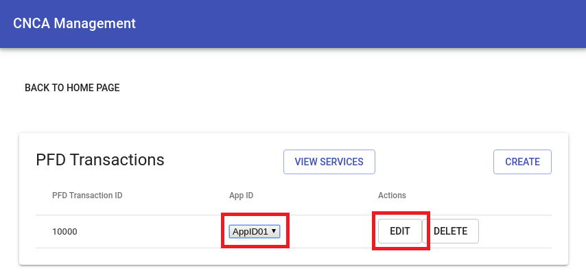

   * To delete a submitted edge PFD transaction
      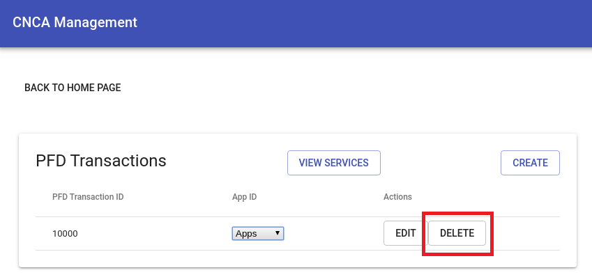

   * To delete a submitted edge PFD transaction application
      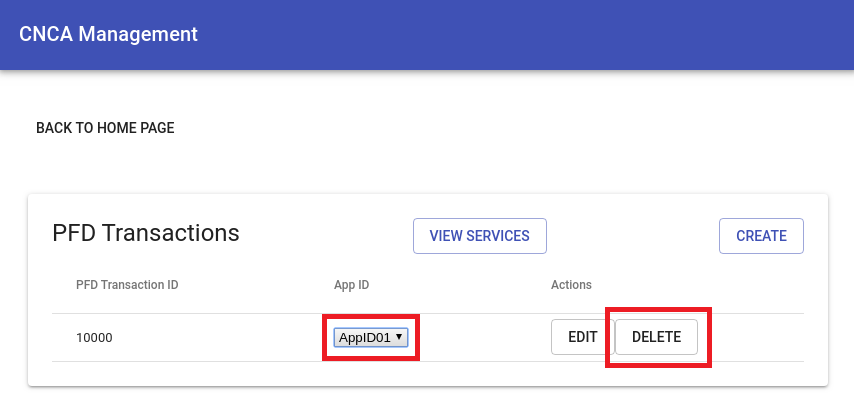

## Traffic Influence Subscription description

This sections describes the paramters that are used in the Traffic Influce subscription POST request. Groups mentioned as Mandatory needs te provided, in the absence of the Mandatory parameters a 400 response would be returned.

### Identification (Mandatory)

| Attribute name | Description                                                                                                                           |
| -------------- | ------------------------------------------------------------------------------------------------------------------------------------- |
| afTransId      | Identifies an NEF Northbound interface transaction, generated by the AF                                                               |
| self           | Link to this resource. This parameter shall be supplied by the NEF in HTTP POST responses, which is used by AF for further operations |

### Traffic Description Group (Mandatory)

| Attribute name | Description                                                           |
| -------------- | --------------------------------------------------------------------- |
| afServiceId    | Identifies a service on behalf of which the AF is issuing the request |
| dnn            | Identifies a DNN                                                      |
| snssai         | Identifies an S-NSSAI                                                 |

Note: One of afServiceId or dnn shall be included

| Attribute name    | Description                        |
| ----------------- | ---------------------------------- |
| afAppId           | Identifies an application          |
| trafficFilters    | Identifies IP packet filters       |
| ethTrafficFilters | Identifies Ethernet packet filters |

Note: One of "afAppId", "trafficFilters" or "ethTrafficFilters" shall be included

### Target UE Identifier (Mandatory)

| Attribute name  | Description                                                                                                                                 |
| --------------- | ------------------------------------------------------------------------------------------------------------------------------------------- |
| externalGroupId | Identifies a group of users                                                                                                                 |
| anyUeInd        | Identifies whether the AF request applies to any UE. This attribute shall set to "true" if applicable for any UE, otherwise, set to "false" |
| gpsi            | Identifies a user                                                                                                                           |
| ipv4Addr        | Identifies the IPv4 address                                                                                                                 |
| ipv6Addr        | Identifies the IPv6 address                                                                                                                 |
| macAddr         | Identifies the MAC address                                                                                                                  |

Note: One of individual UE identifier (i.e. "gpsi", "ipv4Addr", "ipv6Addr" or macAddr), External Group Identifier (i.e. "externalGroupId") or any UE indication "anyUeInd" shall be included

### Application Relocation (Optional)

| Attribute name | Description                                                                                                                                                                                                  |
| -------------- | ------------------------------------------------------------------------------------------------------------------------------------------------------------------------------------------------------------ |
| appReloInd     | Identifies whether an application can be relocated once a location of the application has been selected. Set to "true" if it can be relocated; otherwise set to "false". Default value is "false" if omitted |

### Traffic Routing (Optional)

| Attribute name | Description                                   |
| -------------- | --------------------------------------------- |
| trafficRoutes  | Identifies the N6 traffic routing requirement |

### Spatial Validity (Optional)

| Attribute name  | Description                                                                                                         |
| --------------- | ------------------------------------------------------------------------------------------------------------------- |
| validGeoZoneIds | Identifies a geographic zone that the AF request applies only to the traffic of UE(s) located in this specific zone |

### Temporal Validity (Optional)

| Attribute name | Description                                                                 |
| -------------- | --------------------------------------------------------------------------- |
| tempValidities | Indicates the time interval(s) during which the AF request is to be applied |

### UPF Event Notifications (Optional)

| Attribute name          | Description                                                                                                                  |
| ----------------------- | ---------------------------------------------------------------------------------------------------------------------------- |
| subscribedEvents        | Identifies the requirement to be notified of the event(s)                                                                    |
| dnaiChgType             | Identifies a type of notification regarding UP path management event                                                         |
| notificationDestination | Contains the Callback URL to receive the notification from the NEF. It shall be present if the "subscribedEvents" is present |

### AF to NEF specific (Optional)

| Attribute name          | Description                                                                                                                                                                                                                                             |
| ----------------------- | ------------------------------------------------------------------------------------------------------------------------------------------------------------------------------------------------------------------------------------------------------- |
| suppFeat                | Indicates the list of Supported features used as described in subclause 5.4.4. This attribute shall be provided in the POST request and in the response of successful resource creation. Values 1 - Notification_websocket 2 -  Notification_test_event |
| requestTestNotification | Set to true by the AF to request the NEF to send a test notification as defined in subclause 5.2.5.3 of 3GPP TS 29.122 [4]. Set to false or omitted otherwise                                                                                           |
| websockNotifConfig      | Configuration parameters to set up notification delivery over Websocket protocol                                                                                                                                                                        |

## Packet Flow Description transaction description

This sections describes the parameters that are used in the Packet flow description POST request. Groups mentioned as Mandatory needs to be provided, in the absence of the Mandatory parameters a 400 response would be returned.

| Attribute name   | Mandatory | Description                                                                                                                            |
| ---------------- | --------- | -------------------------------------------------------------------------------------------------------------------------------------- |
| externalAppID    | Yes       | Unique Application identifier of a PFD                                                                                                 |
| Allowed Delay    | No        | Indicates that the list of PFDs in this request should be deployed within the time interval indicated by the Allowed Delay             |
| Caching Time     | No        | It shall be included when the allowed delayed cannot be satisfied, i.e. it is smaller than the caching time configured in fetching PFD |
| pfdId            | Yes       | Identifies a PFD of an application identifier.                                                                                         |
| flowDescriptions | NOTE      | Represents a 3-tuple with protocol, server ip and server port for UL/DL application traffic.                                           |
| Urls             | NOTE      | Indicates a URL or a regular expression which is used to match the significant parts of the URL.                                       |
| domainName       | NOTE      | Indicates an FQDN or a regular expression as a domain name matching criteria.                                                          |

**NOTE:**
One of the attribute of flowDescriptions, URls and domainName is mandatory.
