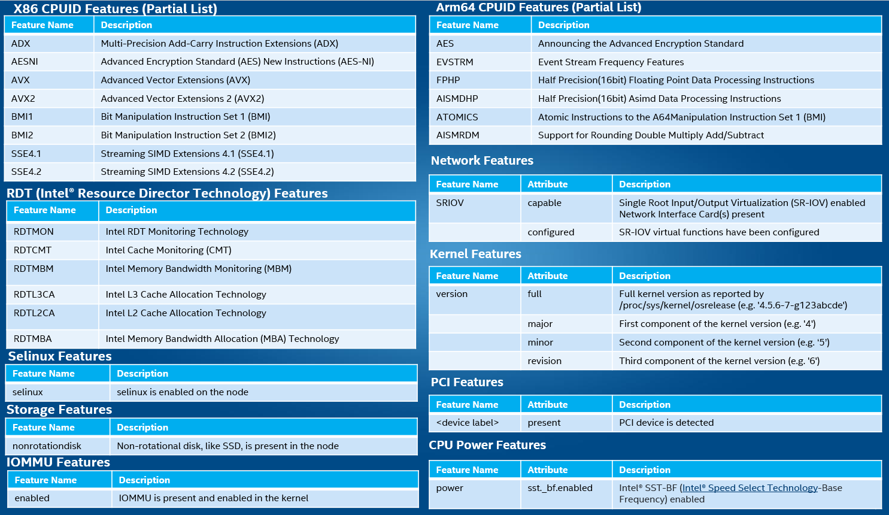

```text
SPDX-License-Identifier: Apache-2.0
Copyright (c) 2019 Intel Corporation
```
<!-- omit in toc -->
# Node Feature Discovery support in OpenNESS
- [Overview of NFD and Edge usecase](#overview-of-nfd-and-edge-usecase)
- [Details](#details)
  - [Node Feature Discovery support in OpenNESS On Premises](#node-feature-discovery-support-in-openness-on-premises)
    - [Usage](#usage)
- [Reference](#reference)

## Overview of NFD and Edge usecase

COTS Platforms used for edge deployment come with many features that enable workloads take advantage of, to provide better performance and meet the SLA. When such COTS platforms are deployed in a cluster as part of a Cloudnative deployment it becomes important to detect the hardware and software features on all nodes that are part of that cluster. It should also be noted that some of the nodes might have special accelerator hardware like FPGA, GPU, NVMe, etc.

Let us consider an edge application like CDN that needs to be deployed in the cloud native edge cloud. It would be favorable for a Container orchestrator like Kubernetes to detect the nodes that have CDN friendly hardware and software features like NVMe, media extensions and so on.

Now let us consider a Container Network Function (CNF) like 5G gNb that implements L1 5G NR base station. It would be favorable for the Container orchestrator like Kubernetes to detect nodes that have hardware and software features like FPGA acceleration for Forward error correction, Advanced vector instructions to implement math functions, real-time kernel and so on.

OpenNESS supports the discovery of such features using Node Feature Discovery (NFD). NFD is a Kubernetes add-on that detects and advertises hardware and software capabilities of a platform that can, in turn, be used to facilitate intelligent scheduling of a workload. NFD was adjusted to be used in OpenNESS without Kubernetes (refer to [Node Feature Discovery support in OpenNESS On Premises](#node-feature-discovery-support-in-openness-on-premises) for details). Node Feature Discovery is one of the Intel technologies that supports targeting of intelligent configuration and capacity consumption of platform capabilities. NFD runs as a separate container on each individual node of the cluster, discovers capabilities of the node, and finally, publishes these as node labels using the Kubernetes API. NFD only handles non-allocatable features.

Some of the Node features that NFD can detect include:



_Figure - Sample NFD Features_

At its core, NFD detects hardware features available on each node in a cluster, and advertises those features using node labels.

NFD consists of two software components:

1) nfd-master is responsible for labeling node objects
2) nfd-worker detects features and communicates them to the nfd-master. One instance of nfd-worker should be run on each node of the cluster

The figure below illustrates how the CDN application will be deployed on the right platform when NFD is utilized, where the required key hardware like NVMe and AVX instruction set support is available.


_Figure - CDN app deployment with NFD Features_

> Non-Volatile Memory Express* is a scalable non-volatile memory host interface that can help increase efficiency and reduce latency, while providing high speed access to storage media connected over PCIe.  NVMe overcomes SAS/SATA SSD performance limitations by optimizing hardware and software to take full advantage of NVM SSD technology

> AVX CPUID Features: Intel® Advances Vector Extensions 512 (Intel® AVX 512)

> UEFI Secure Boot: Boot Firmware verification and authorization of OS Loader/Kernel  components

## Details

### Node Feature Discovery support in OpenNESS On Premises

Node Feature Discovery is enabled by default. It does not require any configuration or user input. It can be disabled by changing the `onprem_nfd_enable` variable to `false` in the `oek/group_vars/all/10-default.yml` before OpenNESS installation.

NFD service in OpenNESS On Premises consists of two software components:

- *nfd-worker*, which is taken from https://github.com/kubernetes-sigs/node-feature-discovery (downloaded as image)
- *nfd-master*: stand alone service run on Edge Controller.

Nfd-worker connects to nfd-master server. Connection between nfd-workers and nfd-master is secured by TLS based certificates used in Edge Node enrollment: nfd-worker uses certificates of Edge Node, nfd-master generates certificate based on Edge Controller root certificate. Nfd-worker provides hardware features to nfd-master which stores that data to the controller mysql database. It can be used then as EPA Feature requirement while defining and deploying app on node.

#### Usage

NFD is working automatically and does not require any user action to collect the features from nodes.
Default version of nfd-worker downloaded by ansible scripts during deployment is v.0.5.0. It can be changed by setting variable `_nfd_version` in `oek/roles/nfd/onprem/worker/defaults/main.yml`.

Features found by NFD are visible in Edge Controller UI in node's NFD tab. While defining edge application (Controller UI->APPLICATIONS->ADD APPLICATION), `EPA Feature` fields can be used as definition of NFD requirement for app deployment. Eg: if application requires Multi-Precision Add-Carry Instruction Extensions (ADX), user can set EPA Feature Key to `nfd:cpu-cpuid.ADX` and EPA Feature Value to `true`.


Deployment of such application will fail for nodes that don't provide this feature with this particular value. List of features supported by nfd-worker service can be found: https://github.com/kubernetes-sigs/node-feature-discovery#feature-discovery. Please note that `nfd:` prefix always has to be added when used as EPA Feature Key.

## Reference
More details about NFD can be found here: https://github.com/Intel-Corp/node-feature-discovery
