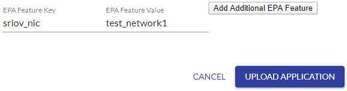
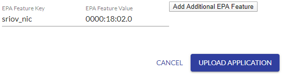

```text
SPDX-License-Identifier: Apache-2.0
Copyright (c) 2019-2020 Intel Corporation
```
<!-- omit in toc -->
# Multiple Interface and PCIe SRIOV support in OpenNESS
- [Overview](#overview)
  - [SRIOV for On-Premises](#sriov-for-on-premises)
    - [Edgenode Setup](#edgenode-setup)
    - [Docker Container Deployment Usage](#docker-container-deployment-usage)
    - [Virtual Machine Deployment Usage](#virtual-machine-deployment-usage)
- [Reference](#reference)

## Overview

Edge deployments consist of both Network Functions and Applications. Cloud Native solutions like Kubernetes typically expose only one interface to the Application or Network function PODs. These interfaces are typically bridged interfaces. This means that Network Functions like Base station or Core network User plane functions and Applications like CDN etc. are limited by the default interface.

### SRIOV for On-Premises

Support for providing SR-IOV interfaces to containers and virtual machines is available for OpenNESS On-Premises deployments.

#### Edgenode Setup

To make sure that deployment will build properly - add in `group_vars/edgenode_group/10-default.yml` under the variable `default_grub_params` line `pci=realloc`.

In order to configure the number of SR-IOV VFs on the node, the `network_interfaces` variable located under `sriov` in `oek/host_vars/node01.yml` needs to be updated with the physical network interfaces on the node where the VFs should be created, along with the number of VFs to be created for each interface. The format this information should be provided in is `{interface_name: number_of_vfs, ...}`.

> Note: Remember that each node must be added to the ansible inventory file `oek/inventory.ini` if they are to be deployed by the ansible scripts.

To inform the installer of the number of VFs to configure for use with virtual machine deployments, the variable `vm_vf_ports` must be set, e.g. `vm_vf_ports: 4` tells the installer to configure four VFs for use with virtual machines. The installer will use this setting to assign that number of VFs to the kernel pci-stub driver so that they can be passed to virtual machines at deployment.

When deploying containers in On-Premises mode, additional settings in the `oek/host_vars/node01.yml` file are required so the installer can configure the VFs correctly. Each VF will be assigned to a Docker network configuration which will be created by the installer. To do this, the following variables must be configured:
- `interface_subnets`: This contains the subnet information for the Docker network that the VF will be assigned to. Must be provided in the format `[subnet_ip/subnet_mask,...]`.
- `interface_ips`: This contains the gateway IP address for the Docker network which will be assigned to the VF in the container. The address must be located within the subnet provided above. Must be provided in the format `[ip_address,...]`.
- `network_name`: This contains the name of the Docker network to be created by the installer. Must be in the format `[name_of_network,...]`.

An example `oek/host_vars/node01.yml` which enables 4 VFs across two interfaces with two VFs configured for virtual machines and two VFs configured for containers is shown below:

```yaml
sriov:
  network_interfaces: {enp24s0f0: 2, enp24s0f1: 2}
  interface_subnets: [192.168.1.0/24, 192.168.2.0/24]
  interface_ips: [192.168.1.1, 192.168.2.1]
  network_name: [test_network1, test_network2]
  vm_vf_ports: 2
```

> Note: When setting VFs for On-Premises mode the total number of VFs assigned to virtual machines and containers *must* match the total number of VFs requested, i.e. if requesting 8 VFs in total, the amount assigned to virtual machines and containers *must* also total to 8.

#### Docker Container Deployment Usage

To assign a VF to a Docker container at deployment, the following steps are required once the Edge Node has been set up by the ansible scripts with VFs created.

1. On the Edge Node, run `docker network ls` to get the list of Docker networks available. These should include the Docker networks assigned to VFs by the installer.
```bash
# docker network ls
NETWORK ID          NAME                DRIVER              SCOPE
74d9cb38603e        bridge              bridge              local
57411c1ca4c6        host                host                local
b8910de9ad89        none                null                local
c227f1b184bc        test_network1       macvlan             local
3742881cf9ff        test_network2       macvlan             local
```
> Note: if you want to check the network settings for a specific network, simply run `docker network inspect <network_name>` on the Edge Node.
2. Log into the controller UI and go to the Applications tab to create a new container application with the *EPA Feature Key* set to `sriov_nic` and the *EPA Feature Value* set to `network_name`.

3. To verify that the additional interface was configured run `docker exec -it <container_name> ip a s` on the deployed container. The output should be similar to the following, with the new interface labelled as eth0.
```bash
1: lo: <LOOPBACK,UP,LOWER_UP> mtu 65536 qdisc noqueue state UNKNOWN group default qlen 1000
    link/loopback 00:00:00:00:00:00 brd 00:00:00:00:00:00
    inet 127.0.0.1/8 scope host lo
       valid_lft forever preferred_lft forever
111: eth0@if50: <NO-CARRIER,BROADCAST,MULTICAST,UP> mtu 1500 qdisc noqueue state LOWERLAYERDOWN group default
    link/ether 02:42:c0:a8:01:02 brd ff:ff:ff:ff:ff:ff link-netnsid 0
    inet 192.168.1.2/24 brd 192.168.1.255 scope global eth0
       valid_lft forever preferred_lft forever
112: vEth1: <BROADCAST,MULTICAST> mtu 1500 qdisc noop state DOWN group default qlen 1000
    link/ether 9a:09:f3:84:f9:7b brd ff:ff:ff:ff:ff:ff
```

#### Virtual Machine Deployment Usage

To assign a VF to a virtual machine at deployment, the following steps are required on the Edge Node that has been set up by the ansible scripts with VFs created.

1. On the Edge Node, get the list of PCI address bound to the pci-stub kernel driver by running `ls /sys/bus/pci/drivers/pci-stub`. The output should look similar to the following:
```bash
# ls /sys/bus/pci/drivers/pci-stub
0000:18:02.0  0000:18:02.1  bind  new_id  remove_id  uevent  unbind
```
2. Log into the controller UI and go to the Applications tab to create a new virtual machine application with the *EPA Feature Key* set to `sriov_nic` and the *EPA Feature Value* set to `pci_address`.

3. To verify that the additional interface was configured run `virsh domiflist <vm_name>` on the Edge Node. The output should be similar to the following, with the hostdev device for the VF interface shown.
```bash
Interface  Type       Source     Model       MAC
-------------------------------------------------------
-          network    default    virtio      52:54:00:39:3d:80
-          vhostuser  -          virtio      52:54:00:90:44:ee
-          hostdev    -          -           52:54:00:eb:f0:10
```

## Reference

For further details
- SR-IOV CNI: https://github.com/intel/sriov-cni
